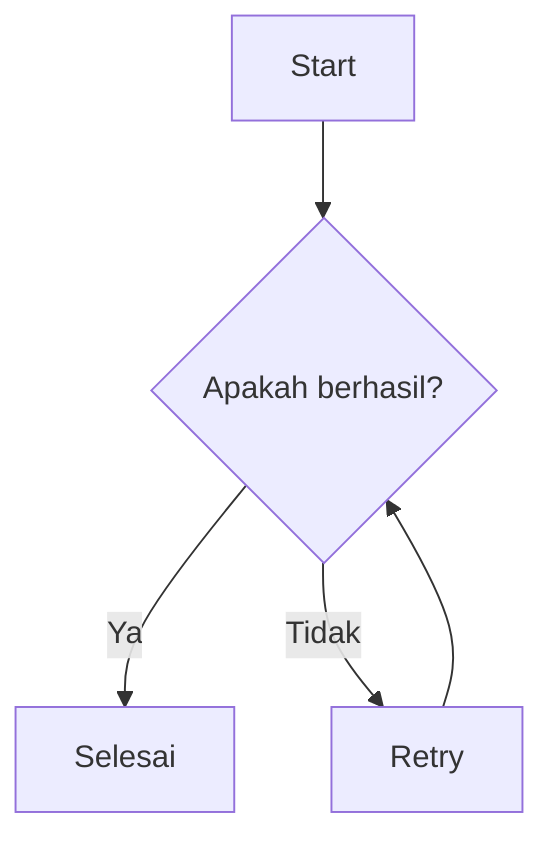
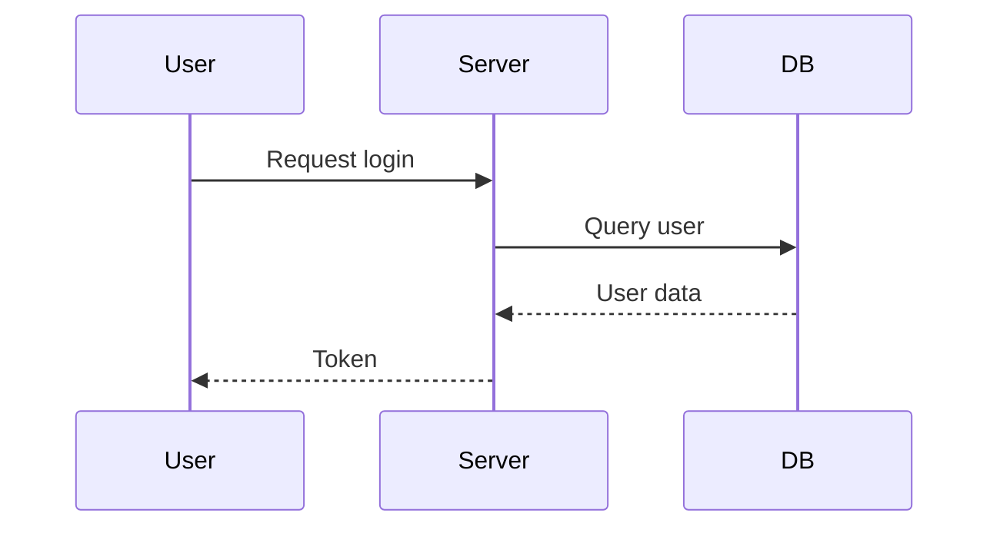

## Blockquote
Penulisan `Blockquote` menggunakan simbol `>` di awal kalimat.  
Sebagai contoh:  

```markdown {5}
> Ini adalah Blockquote

<!-- Menambahkan paragraf baru -->
> Ini adalah Blockquote
> <!-- Ini line kosong untuk batas antar paragraf -->
> Ini paragraf baru

<!-- Menambahkan Cite -->
> Ini adalah Blockquote  
> <cite>Sumber</cite>
```

> [!NOTE]
> Untuk menambahkan paragraf baru berikan pemisah antar kalimat dengan simbol `>` tanpa kalimat.

## List
Penulisan list terbagi 2 jenis, **Order List** dan **Ordered List**.  
<abbr title="List yang tidak berurutan">Unordered List</abbr> Menggunakan simbol `-` atau `+`, sedangkan <abbr title="List yang berurutan">Ordered List</abbr> menggunakan angka.

```markdown

<!-- Order List -->
1. List 1
2. List 2
3. List 3
4 ...

<!-- Unordered List -->
- List 1
- List 2
- List 3
- ...
```

Jika di kombinasi:  

```markdown
<!-- Ordered List -->
1. List 1
2. List 2
3. List 3
  - List 3.1
  - List 3.2
4. ...

<!-- Unordered List -->
- List 1
- List 2
- List 3
  1. List 1
  2. List 2
  3. List 3
- ...
```  

> [!TIP]
> Jika ingin membuat list dengan kombinasi yg lain berikan jarak sebanyak 2 spasi sebelum simbolnya

### Task List
Cara penulisan ini sedikit berbeda dengan list sebelumnya, yang mana menggunakan simbol dari Ordered list dan ditambah simbol `[ ]` dan `[x]`.  

```markdown
- [ ] Taks list tidak aktif
- [x] Taks list aktif
```

### Definisi List
Untuk penulisan Definisi List tidak sama dengan list nya, Kalimat pertama akan menjadi Kepala, dan kalimat kedua menggunakan simbol `:` akan menjadi deskripsinya.  
Sebagai Contoh:  

```markdown ins={13}
Item 1
: Deskripsi 1

Item 2
: Deskripsi 2

<!-- Membuat deskripsi multi kalimat -->
Item 1
: Deskripsi 1

Item 2
: Deskripsi 2
  <!-- disini garis kosong -->
  Deskripsi tambahan
```
> [!TIP]
> Menambah atau membuat deskripsi multi kalimat, berikan garis kosong dan tambah kalimat baru tanpa simbol `:` digaris baru.  

### Block Kode
Penulisan Block Kode menggunakan simbol `~~~` atau ` ``` ` sebagai Block nya.  
Sebagai contoh:  

~~~
```
<!doctype html>
<html lang="en">
  <head>
    <meta charset="utf-8" />
    <title>Example HTML5 Document</title>
  </head>
  <body>
    <p>Test</p>
  </body>
</html>
```
~~~

Menambahkan bahasa berdasarkan kode:  

~~~
```html
<!doctype html>
<html lang="en">
  <head>
    <meta charset="utf-8" />
    <title>Example HTML5 Document</title>
  </head>
  <body>
    <p>Test</p>
  </body>
</html>
```
~~~

### Tabel
Membuat tabel di markdown menggunakan simbol `|` dan `---` sebagai batas pemisah.  

`| Judul |`  
: Akan menjadi isi dari tabel.  

`| ---- |`  
: Akan menjadi batas antar kepala dan isi tabel.  

Disini juga bisa menentukan posisi teks dalam tabel menggunakan:  

`| :--- |`
: Semua teks akan rata kiri.

`| ---- |`
: Semua teks akan rata tengah.

`| ---: |`
:  Semua teks akan rata kanan.  

Sebagai contoh:  

```markdown
| Judul 1 | Judul 2 |
| ---- | ---- |
| Isi 1 | Isi 2 |
```  

## Detail summary
Penulisan Detail summary ini menggunakan sintak kode html murni yaitu `<details>` dan `<summary>`.  
Cara penulisan:  

~~~mdx
<details>
  <summary>Ini sebagai judul</summary

  Ini Sebagai isi
</details>
~~~

## Gambar

Menambahkan gambar di dalam markdown menggunakan kode sintak ``:  

```markdown


<!-- Menampilkan title -->

```  

Menggunakan `<picture>`:  

```markdown
<picture>
  <source srcset="/pantai.jpg" type="image/jpg" />
  
</picture>
```

Menggunakan `<figure>` dan memberikan caption menggunakan `<figcaption>`:  

```markdown
<figure>
  
  <figcaption>Pemandangan diatas diambil pada saat malam hari</figcaption>
</figure>
```

Membuat gambar menjadi link:  

```markdown
<figure>
  <a href="link-tujuan">
    
  </a>
  <figcaption>Klik gambar untuk membuka situs.</figcaption>
</figure>

<!-- Atau -->
[](link-tujuan)
```

## Video
Untuk menambahkan video ke markdown, terdapat beberapa cara:  
1. Menggunakan `<video>` untuk video lokal.
2. Menggunakan `<iframe>` untuk video yang di embed.  

Berikut cara penulisannya:  

```markdown
<video title="Judul Video" poster="gambar-poster-video" width="lebar video" height="tinggi video" controls muted autoplay="false" loop="false" preload>
  <source src="link-video" />
  <!-- Opsional tambahkan Teks jika error -->
  Browser Anda tidak mendukung tag video.
</video>

<!-- Video Embed -->
<iframe
  width='lebar frame'
  height='tinggi frame'
  src="link-embed-video"
  title="Judul Video"
  frameborder="0"
  allow="accelerometer; autoplay; clipboard-write; encrypted-media; gyroscope; picture-in-picture"
  allowfullscreen>
</iframe>
```
## Garis Horisontal
Menambahkan garis horisontal sebagai pembatas antar paragraf bisa menggunakan `---` :  

```markdown {4}
## Judul
Isi paragraf  

---

## Judul
Isi paragraf 
```

## Line Break
Menambahkan Line Break antar kalimat bisa menggunakan *Spasi sebanyak 2 kali* diakhir teks terkahir, atau dengan `<br/>`.  

```markdown {1} {4}
Baris 1  <!-- Spasi disini --> 
Baris 2 (dua spasi di akhir baris)

Baris 1<br />
Baris 2 (pakai tag br)
```

## Footnotes  
Membuat footnote di dalam markdown menggunakan `Kalimat[^nomor-referensi]` dan `[^nomor-referensi]: isi referensi`.  

```markdown
CSS[^1], HTML[^2], Wikipedia[^3]

[^1]: Cascading Style Sheets
[^2]: HyperText Markup Language
[^3]: Kunjungin sumber resmi [label](link-tujuan)
```  

## Math
Penulisan Matematika menggunakan simbol `$$`.  

```markdown
Inline: $$E = mc^2$$

Block:

$$
\int_{a}^{b} f(x) \, dx = F(b) - F(a)
$$

Matrix:

$$
\begin{pmatrix}
a & b \\
c & d
\end{pmatrix}
$$
```

## Diagram
Penulisan diagram di markdown menggunakan simbol yang sama dengan [Kode Block](#kode-block), tetapi menggunakan bahasa `mermaid`.  
~~~mdx {1} {9}



~~~

## Komentar  
Memberikan komentar didalam markdown bisa menggunakan `<!-- Komentar -->`, maka hasil nya tidak akan dirender.  
<small>Hanya untuk Penulis</small>
