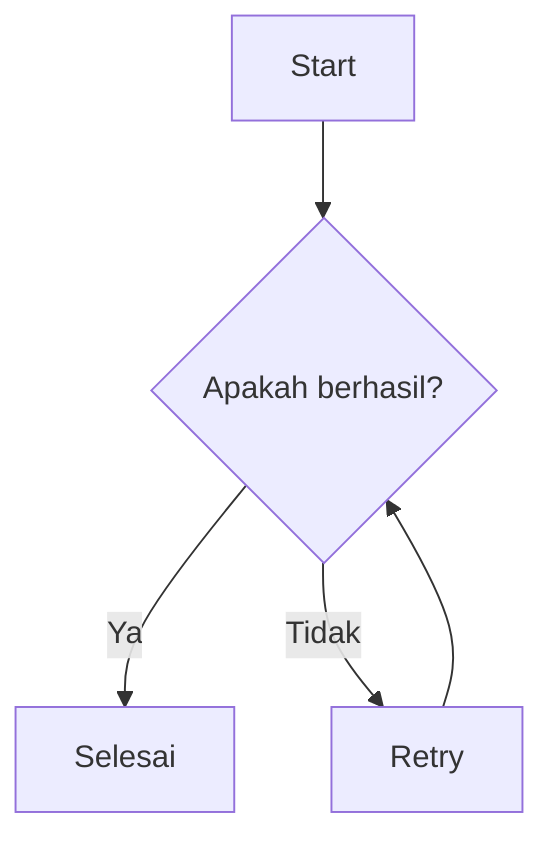
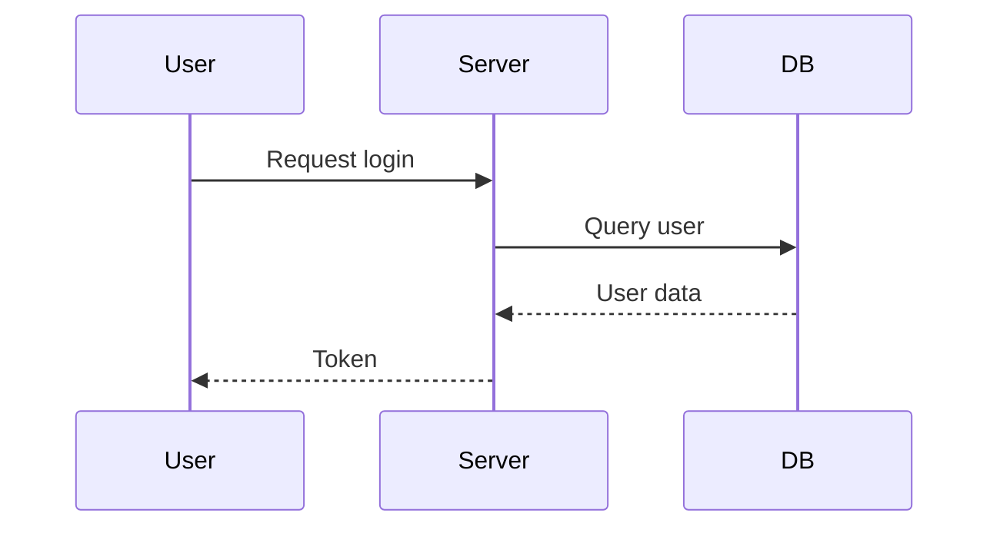

# H1 - The Quick Brown Fox
Lorem ipsum dolor sit amet consectetur adipisicing elit.

## H2 - The Quick Brown Fox
Lorem ipsum dolor sit amet consectetur adipisicing elit.

### H3 - The Quick Brown Fox
Lorem ipsum dolor sit amet consectetur adipisicing elit.

#### H4 - The Quick Brown Fox
Lorem ipsum dolor sit amet consectetur adipisicing elit.

##### H5 - The Quick Brown Fox
Lorem ipsum dolor sit amet consectetur adipisicing elit.

###### H6 - The Quick Brown Fox
Lorem ipsum dolor sit amet consectetur adipisicing elit.

## Paragraph
Lorem ipsum dolor sit amet, consectetur adipiscing elit. Sed do eiusmod tempor incididunt ut labore et dolore magna aliqua. Ut enim ad minim veniam, quis nostrud exercitation ullamco laboris nisi ut aliquip ex ea commodo consequat. Duis aute irure dolor in reprehenderit in voluptate velit esse cillum dolore eu fugiat nulla pariatur.

## Links
```markdown
[internal link](#)

[external link](external-url)

[`code link`](#)

[](url-badge)

[ name](url-profile) 

[](url-profile)

<https://example.com>

<email@example.com>
```

- [internal link](#)
- [external link](external-url)
- [`code link`](#)
- [](/)
- [ name](/) 
- [](/)
- <https://example.com>
- <email@example.com>

## Text Formatting
```markdown
<b>Bold</b>

<strong>Bold</strong>

<i>Italic</i>

<em>Italic</em>

<b><i>Bold Italic</i></b>

<strong><em>Bold Italic</em></strong>

<s>strikethrough</s>

<del>strikethrough</del>

~~strikethrough~~

<ins>inserted</ins>

<u>inserted</u>

<mark>highlighted</mark>

<small>small</small>

<abbr title="HyperText Markup Language">HTML</abbr>
```

- **Bold**
  - <b>Bold</b>
- *Italic*
  - <i>Italic</i>
- ***Bold + Italic***
  - <b><i>Bold + Italic</i></b>
- <s>strikethrough</s>
  - <del>strikethrough</del>
    - ~~strikethrough~~
- <ins>inserted</ins>
  - <u>inserted</u>
- <mark>highlighted</mark>
- <small>small</small>
- <abbr title="HyperText Markup Language">HTML</abbr>

## Escape karakter

```markdown
\*bukan italic\*

\_bukan italic\_

\`bukan code\`

\#bukan heading

\[bukan link\]

\\backslash
```

\*bukan italic\*

\_bukan italic\_

\`bukan code\`

\#bukan heading

\[bukan link\]

\\backslash


## Inline Typography
```markdown
<kbd>Ctrl</kbd> + <kbd>C</kbd>

<samp>Hello, World!</samp>

<var>x</var> = <var>y</var> + 2

<dfn>API</dfn>

`inline code`

Dia berkata <q>ini adalah quote pendek</q> di dalam paragraf.
```

- <kbd>Ctrl</kbd> + <kbd>C</kbd>
- <samp>Hello, World!</samp>
- <var>x</var> = <var>y</var> + 2
- <dfn>API</dfn>
- `inline code`
- Dia berkata <q>ini adalah quote pendek</q> di dalam paragraf.

## Blockquote
```markdown
> Lorem ipsum dolor sit amet, consectetur adipiscing elit.

> Lorem ipsum dolor sit amet, consectetur adipiscing elit.
>
> <cite>John Doe, Penulis</cite>

> Level 1
>
> > Level 2
> >
> > > Level 3

> **Catatan**
>
> > **Sub-catatan**
> >
> > > **Sub-sub-catatan**
```

> Lorem ipsum dolor sit amet, consectetur adipiscing elit.

> Lorem ipsum dolor sit amet, consectetur adipiscing elit.
>
> <cite>John Doe, Penulis</cite>

> Level 1
>
> > Level 2
> >
> > > Level 3

> **Catatan**
>
> > **Sub-catatan**
> >
> > > **Sub-sub-catatan**

## Subscript & Superscript
```markdown
H<sub>2</sub>O dan CO<sub>2</sub>

x<sup>2</sup> + y<sup>2</sup> = z<sup>2</sup>
```

- H<sub>2</sub>O dan CO<sub>2</sub>
- x<sup>2</sup> + y<sup>2</sup> = z<sup>2</sup>

Footnote: footnote[^1] dan footnote[^2].

## Time & Address
```markdown
<time datetime="2026-05-13">13 May 2026</time>

<address>Jl. Sudirman No. 123, Jakarta</address>
```

- <time datetime="2026-09-12">12 September 2026</time>
- <address>Jl. Sudirman No. 123, Jakarta</address>
 
## Ruby
```markdown
<ruby>日本語<rt>にほんご</rt></ruby>
```

- <ruby>日本語<rt>にほんご</rt></ruby>

## Lists

### Unordered List
```markdown
- Item 1
- Item 2
    - Nested item 2.1
    - Nested item 2.2
      - Nested item 2.2.1
      - Nested item 2.2.2
- Item 3
```

- Item 1
- Item 2
    - Nested item 2.1
    - Nested item 2.2
      - Nested item 2.2.1
      - Nested item 2.2.2
- Item 3

### Ordered List
```markdown
1. First item
2. Second item
      1. Nested ordered 2.1
      2. Nested ordered 2.2
3. Third item

1. Item pertama
2. Item kedua
   - Unordered di dalam ordered
   - Item lain
     - Nested lebih dalam
3. Item ketiga

3. Mulai dari 3
4. Lanjut dari 4

- Item
  > Blockquote di dalam list
  
- Item lain
  ~~~js
  code di dalam list
  ~~~
```

1. First item
2. Second item
      1. Nested ordered 2.1
      2. Nested ordered 2.2
3. Third item

1. Item pertama
2. Item kedua
   - Unordered di dalam ordered
   - Item lain
     - Nested lebih dalam
3. Item ketiga

3. Mulai dari 3
4. Lanjut dari 4

- Item
  > Blockquote di dalam list
  
- Item lain
  ```js
  code di dalam list
  ```





## Math

Inline: $E = mc^2$

Block:

$$
\int_{a}^{b} f(x) \, dx = F(b) - F(a)
$$

Matrix:

$$
\begin{pmatrix}
a & b \\
c & d
\end{pmatrix}
$$

### Task List
```markdown
- [x] Task yang sudah selesai
- [ ] Task yang belum selesai
- [ ] Task lain dengan **bold** dan `code`
- [x] Task dengan [link](#)
```

- [x] Task yang sudah selesai
- [ ] Task yang belum selesai
- [ ] Task lain dengan **bold** dan `code`
- [x] Task dengan [link](#)

### Definition List
```markdown
HTML
: HyperText Markup Language adalah bahasa markup untuk web

CSS
: Cascading Style Sheets untuk styling

API
: Application Programming Interface

`code-term`
: Definisi untuk istilah yang berupa `code`

// Atau

<dl>
  <dt>HTML</dt>
  <dd>HyperText Markup Language adalah bahasa markup untuk web</dd>
  
  <dt>CSS</dt>
  <dd>Cascading Style Sheets untuk styling</dd>
  
  <dt>API</dt>
  <dd>Application Programming Interface</dd>
  
  <dt><code>code-term</code></dt>
  <dd>Definisi untuk istilah yang berupa <code>code</code></dd>
</dl>
```

<dl>
  <dt>HTML</dt>
  <dd>HyperText Markup Language adalah bahasa markup untuk web</dd>
  
  <dt>CSS</dt>
  <dd>Cascading Style Sheets untuk styling</dd>
  
  <dt>API</dt>
  <dd>Application Programming Interface</dd>
  
  <dt><code>code-term</code></dt>
  <dd>Definisi untuk istilah yang berupa <code>code</code></dd>
</dl>

## Images & Media
```markdown


<picture>
  <source srcset="image.jpg" type="image/jpg" />
  
</picture>

<figure>
  
  <figcaption>Ini adalah figcaption untuk figure di atas.</figcaption>
</figure>

<figure>
  <a href="/">
    
  </a>
  <figcaption>Klik gambar untuk membuka situs.</figcaption>
</figure>

<video title="Video" poster="/og.jpg" width={720} height={480} controls muted autoplay loop="false" preload>
  <source src="/.github/assets/videos/video.mp4" />
  Browser Anda tidak mendukung tag video.
</video>

[](https://youtu.be/VIDEO_ID)

<iframe
  width="560"
  height="315"
  src="https://www.youtube.com/embed/VIDEO_ID"
  title="YouTube video player"
  frameborder="0"
  allow="accelerometer; autoplay; clipboard-write; encrypted-media; gyroscope; picture-in-picture"
  allowfullscreen
></iframe>
```


<picture>
  <source srcset="image.jpg" type="image/jpg" />
  
</picture>

<figure>
  <a href="/">
    
  </a>
  <figcaption>Klik gambar untuk membuka situs.</figcaption>
</figure>

<figure>
  
  <figcaption>Ini adalah figcaption untuk figure di atas.</figcaption>
</figure>

<video title="Video" poster="/og.jpg" width={720} height={480} controls muted autoplay loop="false" preload>
  <source src="/.github/assets/videos/video.mp4" />
  Browser Anda tidak mendukung tag video.
</video>

[](https://youtu.be/VIDEO_ID)

<iframe
  width="560"
  height="315"
  src="https://www.youtube.com/embed/VIDEO_ID"
  title="YouTube video player"
  frameborder="0"
  allow="accelerometer; autoplay; clipboard-write; encrypted-media; gyroscope; picture-in-picture"
  allowfullscreen
></iframe>

## Table

```markdown
| Column 1 | Column 2 | Column 3 |
| :---- | :----- | :----- |
| Data 1 | Data 2 | Data 3 |
| Data 1 | Data 2 | Data 3 |

// Atau

<table>
  <thead>
    <th>Column 1</th>
    <th>Column 2</th>
    <th>Column 3</th>
  </thead>
  <tbody>
    <tr>
      <td>Data 1</td>
      <td>Data 2</td>
      <td>Data 3</td>
    </tr>
    <tr>
      <td>Data 1</td>
      <td>Data 2</td>
      <td>Data 3</td>
    </tr>
  </tbody>
</table>
```

<table>
  <thead>
    <th>Column 1</th>
    <th>Column 2</th>
    <th>Column 3</th>
  </thead>
  <tbody>
    <tr>
      <td>Data 1</td>
      <td>Data 2</td>
      <td>Data 3</td>
    </tr>
    <tr>
      <td>Data 1</td>
      <td>Data 2</td>
      <td>Data 3</td>
    </tr>
  </tbody>
</table>

## Details & Summary

```markdown
<details>
<summary>Click untuk buka details</summary>

Ini adalah content di dalam details. Bisa ada **bold**, `code`, dan [link](#).

- List di dalam details
- Item 2

> Blockquote di dalam details

</details>
```

<details>
<summary>Click untuk buka details</summary>

Ini adalah content di dalam details. Bisa ada **bold**, `code`, dan [link](#).

- List di dalam details
- Item 2

> Blockquote di dalam details

</details>

## Horizontal Rule

```markdown
Di atas ada hr.

---

Di bawah ada hr.

---
```

Di atas ada hr.

---

Di bawah ada hr.

---

## Hardline Break

```markdown
Baris 1  
Baris 2 (dua spasi di akhir baris)

Baris 1<br />
Baris 2 (pakai tag br)

Baris 1\
Baris 2 (backslash di akhir baris)
```

Baris 1  
Baris 2 (dua spasi di akhir baris)

Baris 1<br />
Baris 2 (pakai tag br)

Baris 1\
Baris 2 (backslash di akhir baris)

```markdown
<!-- Ini komentar, tidak akan muncul di output -->

Teks di bawah komentar.
```

<!-- Ini komentar, tidak akan muncul di output -->

Teks di bawah komentar.

## Html Entitas 
```markdown
&copy; &reg; &trade; &amp; &lt; &gt; &nbsp; &mdash; &ndash; &hellip; &laquo; &raquo; &times; &divide;
```

&copy; &reg; &trade; &amp; &lt; &gt; &nbsp; &mdash; &ndash; &hellip; &laquo; &raquo; &times; &divide;

## Emoji Code
```markdown
:smile: :rocket: :fire: :tada: :sparkles: :heart: :+1: :-1:

:warning: :bulb: :books: :memo: :bug: :zap:
```

:smile: :rocket: :fire: :tada: :sparkles: :heart: :+1: :-1:

:warning: :bulb: :books: :memo: :bug: :zap:

[^1]: Ini adalah footnote pertama dengan **bold** dan `code`.
[^2]: Footnote kedua dengan [link](/).